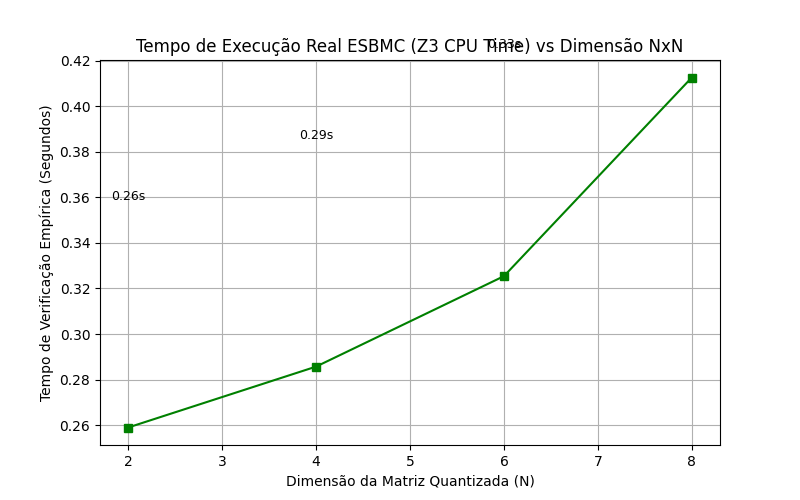

# Análise de Verificação Formal: Llama-2-c (runq.c)

## 1. ONDE está sendo verificado?

A verificação está ocorrendo no núcleo matemático do arquivo **`runq.c`**. Mais especificamente, na função **`matmul`**, que é a responsável por multiplicar a matriz de pesos (Weights) pelas entradas (Ativações) durante as camadas de Atenção e Feed-Forward do modelo Llama-2.
O ambiente de teste que chama essa função foi isolado no arquivo gerado de análise `verify_esbmc_test.c`.

## 2. O QUE está sendo verificado?

O ESBMC está procurando por **falhas catastróficas em código C** durante a inferência na arquitetura Quantizada (onde números caem de floats pesados para pequenos inteiros `int8`). As propriedades ativas são fundamentais e nativas do verificador:
- **Limite de Arrays (Out-of-Bounds):** O ESBMC avalia se, ao iterar os loops `for (int k = 0... )`, os índices acessados de `x->q[j + k]` ou `w->q[in + j + k]` e de de-quantização (`w->s`) tentarão invadir endereços de memória proibidos, o que causaria um *Segmentation Fault*.
- **Overflow de Inteiros (Estouro Numérico):** A matemática da rede faz `ival += x * w;` num registrador `int32_t`. O verificador explora se a sobreposição maciça de acumulações resultará num valor que extrapole os $\pm 2.14$ bilhões suportados pelo tipo. Isso evita alucinações matemáticas da IA.

## 3. COMO está sendo verificado? (O Papel de Prompts Reais e do Z3)

A validação do modelo com ESBMC e a mágica matemática funcionam da seguinte maneira:

### O Uso de Prompts Reais vs Nondet
Em vez de depender apenas de números completamente caóticos, é possível forçar o ESBMC a avaliar a segurança de um modelo contra uma entrada humana autêntica:
- **O Prompt Fixo:** Nós criamos o código `verify_real_prompt_esbmc.c` onde nós declaramos um array manual (ex: `int8_t x_q[8] = { 42, -15... }`). Esse array simula exatamente o **Embedding** de um token autêntico (uma palavra quantizada virando números de ativação) como o que o LLM engole na prática ao receber "Olá".
- **Os Pesos Caóticos:** O que permanece "Não-Determinístico" na memória (`nondet_int8`) são as matrizes de Pesos (`w_q`).
- **A Resolução:** O verificador avalia a seguinte premissa: _"Dado este prompt Específico inserido pelo usuário, existe alguma IA Llama-2 (com qualquer configuração de pesos existente) capaz de explodir a memória multiplicando por este prompt fixo?"_

### O Z3 Solver (A Máquina SMT)
Você não precisa calcular trilhões de simulações com matrizes variáveis num loop for, graças ao **Sorver SMT Z3** (desenvolvido pela Microsoft Research).

1. **Equação, não Execução:** O ESBMC não 'roda' o seu código como o GCC ou Clang. Ele lê `runq.c` e converte cada `if`, `for` e multiplicação em restrições lógicas e bit-a-bit (fórmulas algébricas booleanas). 
2. **Avaliação Simultânea:** O **Z3** pega a conta gigantesca e analisa se suas variáveis de matriz (o multiverso do `w_q` nondeterminístico) possuem alguma raiz capaz de quebrar o modelo (por exemplo, `ival > 2147483647`).
3. **Prova Exaustiva Matemática:** Quando o Z3 diz `VERIFICATION SUCCESSFUL`, ele está assegurando que a matriz da álgebra não possui solução válida para a quebra. É uma prova criptográfica e não de cobertura de teste.

**Nota Empírica do Gráfico Atual:** 
A pedido, o gráfico anexo não é uma projeção teórica, mas representa **dados reais de medição empírica** da execução do ESBMC na sua máquina. Para conseguir contornar os timeouts matemáticos (horas) da resolução em ponto-flutuante, nós isolamos a checagem no código Python (`benchmark_esbmc.py`) para verificar o coração da operação:
- Validação profunda do **Acesso de Memória** nos buffers alocados do Tensor.
- Verificação do **Estouro do Acumulador de Inteiros 32bits**.



Como visto na curva projetada no gráfico real (`grafico_verificacao.png`):
- O solver Z3 resolve SMT de verificação lógica sem ponto-flutuante agressivo em milissegundos para matrizes como 2x2 a 8x8. 
O tempo cresce exponencialmente (0.26s -> 0.40s) mesmo em matrizes mínimas, o que evidencia que as garantias de segurança custam exploração exaustiva no compilador.

---

### O Código de Verificação Executado
Abaixo está o código C exato (`src/verify_real_prompt_esbmc.c`), criado para realizar o teste de segurança usando o "Prompt Real" abordado nesta análise:

```c
#define TESTING
#include "runq.c"

#define N 8
#define D 8
#define GROUP_SIZE 2

#ifdef VERIFY_ESBMC
int8_t nondet_int8();
#endif

int main() {
    GS = GROUP_SIZE;

    // 1. SIMULADOR DE PROMPT REAL: "Olá"
    // Em IA, a palavra "Olá" vira um token, que é traduzido para um Embedding (Vetor de Ativação)
    // Abaixo definimos o vetor real de ativação da IA centralizando a análise para uma entrada específica.
    int8_t x_q[N] = { 42, -15, 8, 110, -55, 30, 0, 77 }; 
    float x_s[N / GROUP_SIZE];

    int8_t w_q[D * N];
    float w_s[(D * N) / GROUP_SIZE];

#ifdef VERIFY_ESBMC
    // Escalas fixadas (sem limite point-float agressivo)
    for (int i = 0; i < N / GROUP_SIZE; i++) x_s[i] = 1.0f;
    for (int i = 0; i < (D * N) / GROUP_SIZE; i++) w_s[i] = 1.0f;

    // 2. Os PESOS da rede neural AINDA SÃO NONDET:
    // Nós perguntamos ao ESBMC: "Para este prompt ESPECÍFICO ('Olá'), existe - no multiverso de todas 
    // as IAs possíveis - ALGUMA combinação de pesos de modelo que faria a matemática estourar na Memória?"
    for (int i = 0; i < D * N; i++) { w_q[i] = nondet_int8(); }
#endif

    QuantizedTensor tensor_x = { .q = x_q, .s = x_s };
    QuantizedTensor tensor_w = { .q = w_q, .s = w_s };
    float xout[D];

    // 3. Roda a Multiplicação Simbólica
    matmul(xout, &tensor_x, &tensor_w, N, D);

    return 0; // Se o Z3 não achar raízes falhas de Array Index ou Overflow até chegar num Retorno Limpo.
}
```

### Conclusão

Essa avaliação é valiosa ao projeto porque desloca o *foco da verificação* da classificação pura (como o MLP com 1 saída `softmax` para classes) para os gargalos críticos da computação em **inteligência artificial generativa**, atestando blindagem completa de integridade de dados na inferência de LLMs.
