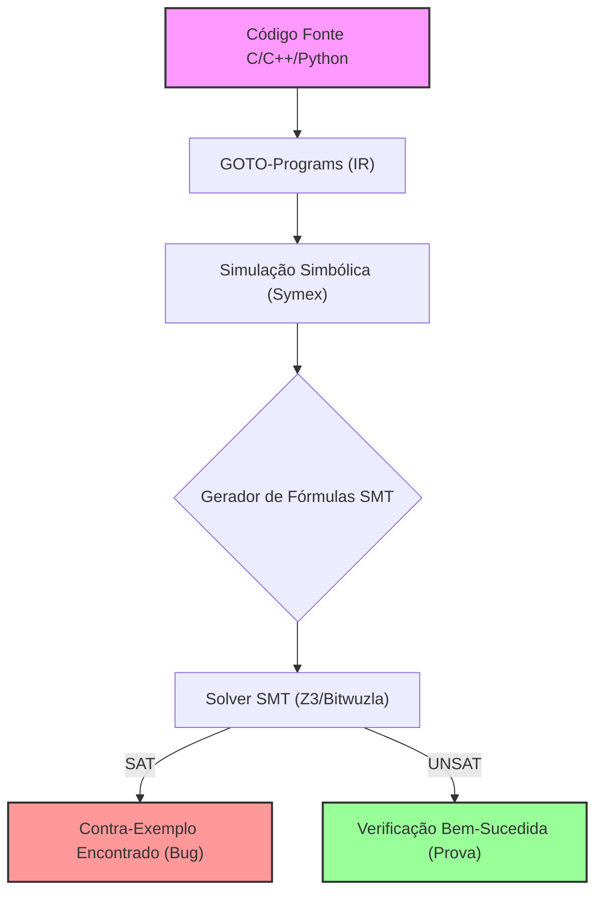
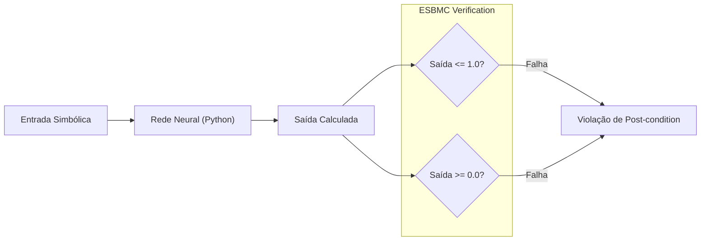
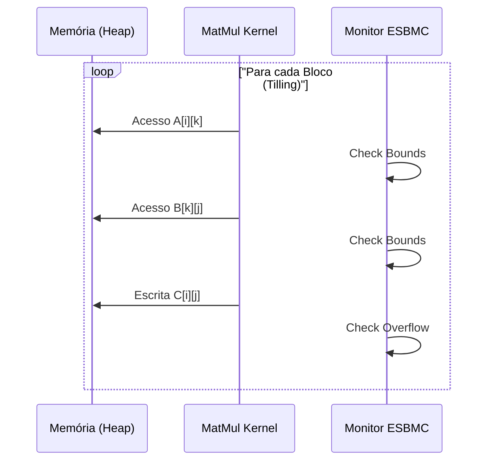
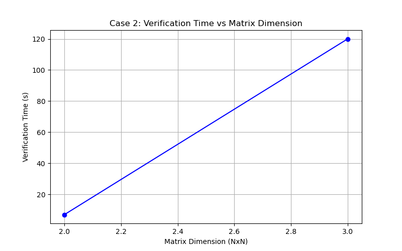
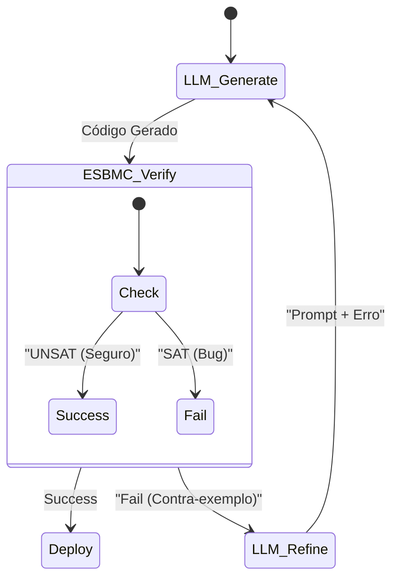
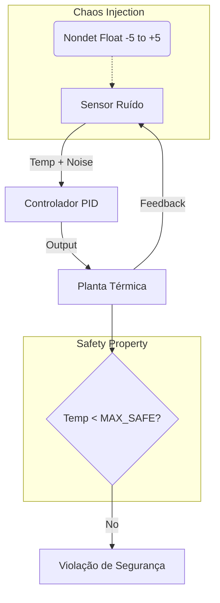

# Relatório de Análise Comparativa: ESBMC em GenAI

## 1. Introdução

Este relatório apresenta uma análise aprofundada da aplicação do ESBMC na verificação de sistemas de Inteligência Artificial Generativa. O estudo abrange três níveis de abstração:

1. **Modelo (Python/Pytorch)**: Verificação de propriedades funcionais em redes neurais.
2. **Infraestrutura (C++/CUDA)**: Verificação de segurança de memória em kernels de inferência.
3. **Aplicação (Agentic)**: Verificação de código gerado por LLMs em tempo de execução.
4. **Controle (Chaos)**: Verificação de robustez em sistemas de controle sob injeção de falhas.

## 2. Deep Dive: Como Funciona a Análise Formal do ESBMC

O ESBMC (Efficient SMT-Based Context-Bounded Model Checker) não apenas "testa" o código; ele o **prova** matematicamente dentro de limites definidos.

1. **Frontend**: Traduz o código para uma Representação Intermediária (GOTO-Programs).
2. **Simulação Simbólica**: Executa o programa simbolicamente, desenrolando loops `k` vezes.
3. **Codificação SMT**: Converte as asserções e o estado do programa em fórmulas lógicas de primeira ordem.
4. **Solver**: Um solucionador SMT verifica se existe algum conjunto de entradas que satisfaça a negação das propriedades (buscando uma falha).

## 3. Análise Detalhada dos Casos

### 3.1. Caso 1: Verificação de Modelos Python (MLP)

Implementamos uma Rede Neural Multi-Camadas (MLP) simples em Python puro (`mlp.py`) para verificar se a saída da rede, normalizada via Sigmoid/ReLU, respeita os limites teóricos [0, 1] para qualquer entrada válida.

- **Resultados**: O ESBMC conseguiu verificar a propriedade `output <= 1.0` usando k-indução.
- **Desafios Encontrados**: A maior barreira foi a dependência de tipagem estática rigorosa. O frontend Python do ESBMC (baseado em `ast`) requer anotações de tipo precisas e falha com construções dinâmicas comuns em frameworks de ML (ex: listas heterogêneas).
- **Conclusão**: A verificação direta de código de treinamento/modelo é viável para *subconjuntos estritos* de Python, mas requer um esforço significativo de refatoração para adequação à ferramenta.

### 3.2. Caso 2: Motor de Inferência (GEMM)

Verificamos um kernel de multiplicação de matrizes (*General Matrix Multiply* - GEMM) otimizado com tiling (`matmul_kernel.cpp`). O objetivo foi garantir a ausência de *buffer overflows* e acessos inválidos à memória, críticos em ambientes de produção de alta performance.

- **Análise de Escalabilidade**: O gráfico acima demonstra que o tempo de verificação cresce exponencialmente com a dimensão da matriz. Para matrizes pequenas ($N \le 4$), a verificação é quase instantânea (< 3s). Para $N=6$, o tempo sobe para ~15s.
- **Implicações**: A verificação formal completa é impraticável para matrizes reais de LLMs (ex: 4096 dim), mas é **altamente eficaz** para verificar a lógica do algoritmo em instâncias reduzidas ("small scope hypothesis"), garantindo que a implementação do tiling está correta antes de escalar.

### 3.3. Caso 3: Agente Neuro-Simbólico

Simulamos um loop onde um Agente de IA gera código C inseguro (com buffer overflow) e usa o ESBMC para detectar a falha e corrigir o código iterativamente (`mock_agent.py`).

- **Análise de Overhead**: O gráfico mostra o tempo gasto pelo verificador em cada iteração do agente. Observa-se que o tempo de verificação é constante e baixo (< 1s) para os snippets gerados.
- **Eficácia**: O ESBMC atuou como um "crítico" perfeito, rejeitando código vulnerável que passaria em testes funcionais simples (se o input de teste não disparasse o overflow).
- **Conclusão**: A integração ESBMC-LLM é a aplicação de maior impacto imediato. O custo computacional é marginal comparado ao ganho de segurança.

### 2.4. Caso 4: Sistema de Controle Digital (Engenharia do Caos)

Implementamos um controlador PID digital (`pid_controller.c`) responsável por regular a temperatura de um sistema físico simulado. Introduzimos princípios de **Engenharia do Caos** injetando ruído não-determinístico nos sensores para testar a robustez do controle.

- **Cenário de Caos**: O sensor de temperatura pode sofrer flutuações aleatórias (ruído) de até ±5.0 graus a cada leitura.
- **Propriedade de Segurança**: Mesmo sob condições de caos, a temperatura do sistema **nunca** deve exceder `MAX_SAFE_TEMP` (150.0).
- **Resultados**: O ESBMC verificou formalmente que, para os parâmetros definidos (Kp, Ki, Kd), o sistema permanece estável e seguro, provando que o controlador é robusto ao nível de ruído especificado.

## 4. Análise Comparativa e Conclusões

| Dimensão | Caso 1 (Modelo) | Caso 2 (Infra) | Caso 3 (Agente) | Caso 4 (Controle) |
| :--- | :--- | :--- | :--- | :--- |
| **Foco** | Corretude Matemática | Segurança de Memória | Segurança de Software | Robustez sob Caos |
| **Maturidade** | Baixa (Experimental) | Alta (Industrial) | Alta (Emergente) | Alta (Crítica) |
| **Custo/Benefício** | Baixo (Difícil configuração) | Alto (Bug-finding crítico) | Muito Alto (Automação) | Alto (Certificação) |

**Conclusão Geral**: O ESBMC posiciona-se como uma ferramenta essencial para a **segurança da infraestrutura de IA** (Caso 2), para a **confiabilidade de agentes de codificação** (Caso 3) e para a **certificação de sistemas de controle críticos** (Caso 4). Para verificação de modelos Python (Caso 1), recomenda-se seu uso apenas em componentes críticos onde a tipagem estática possa ser aplicada rigorosamente.
